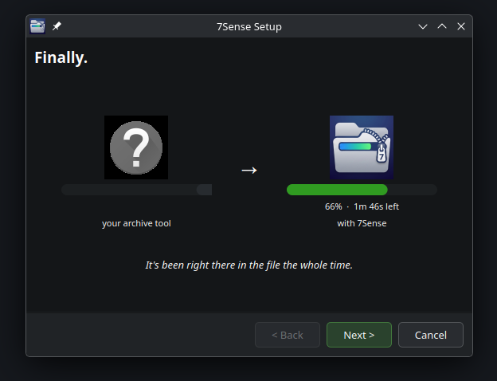
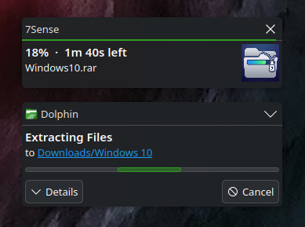
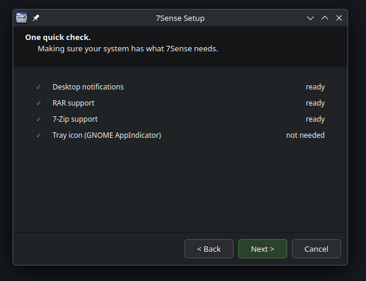
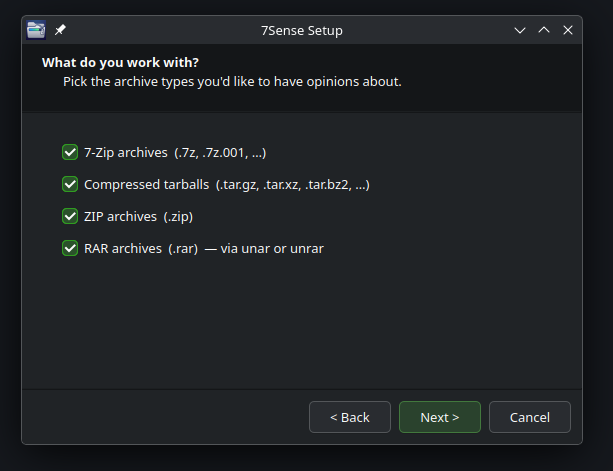
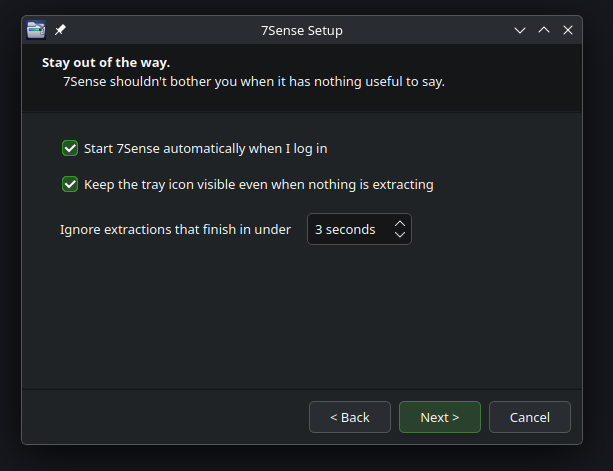
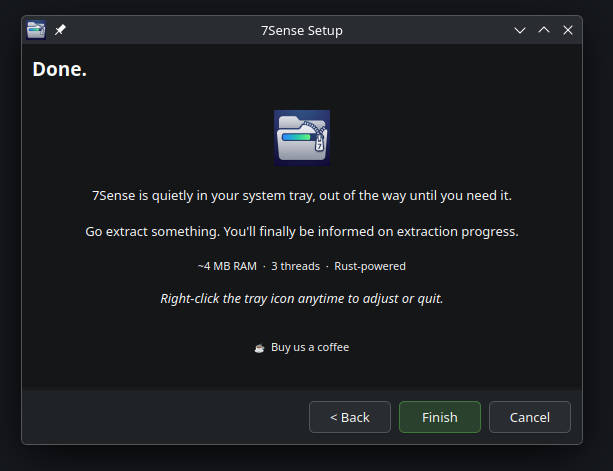

# 7Sense

Your archive tool has known the percentage the whole time. It just wasn't telling you.



7Sense sits quietly in your system tray and watches for archive extractions. When one starts, it pre-scans the archive for its total uncompressed size, then watches the destination folder grow in real time — and turns that into an actual percentage.

Works alongside whatever you already use. No patches to Ark, File Roller, or anything else. No elevated permissions required to run. Uninstalling is deleting one `.desktop` file.

---

## What it looks like



When an extraction starts, a progress window shows the real percentage, time remaining, and the file being extracted. The look adapts to your desktop environment — KDE, GNOME, Xfce, whatever you're running, it fits in.

---

## Embarrassingly small


That's it up there. The whole app.

The daemon is written in Rust and idles at **~4 MB RAM** with a **1.3 MB binary on disk**. No Electron. No embedded browser. No 200 MB Python runtime parked in your tray for the rest of your login session just to watch a folder grow. Three threads total — one drives the D-Bus tray, one runs the monitor loop, one parks main. That's the whole thing.

---

## Setup

A short wizard walks you through everything on first launch. Four screens, takes 10 seconds.

<table>
  <tr>
    <td align="center"><br/><sub>Welcome — the whole point, in one screen</sub></td>
    <td align="center"><br/><sub>Dependency check — installs anything missing for you</sub></td>
  </tr>
  <tr>
    <td align="center"><br/><sub>Pick which archive types to watch</sub></td>
    <td align="center"><br/><sub>A few sensible defaults you can tune</sub></td>
  </tr>
  <tr>
    <td align="center" colspan="2"><br/><sub>Done — 4 MB in your tray, out of your way</sub></td>
  </tr>
</table>

---

## Getting started

### Debian / Ubuntu / Mint — apt (recommended)

Add the repository once and get automatic updates forever:

```bash
curl -fsSL https://jackharvest.github.io/7sense/gpg.key | sudo gpg --dearmor -o /etc/apt/keyrings/7sense.gpg
echo "deb [signed-by=/etc/apt/keyrings/7sense.gpg arch=amd64] https://jackharvest.github.io/7sense stable main" | sudo tee /etc/apt/sources.list.d/7sense.list
sudo apt update
sudo apt install 7sense
```

Done. Future releases install automatically with `sudo apt upgrade` like any other app.

---

### Download and install manually

Grab the right package from the [latest release](https://github.com/jackharvest/7sense/releases/latest).

**Debian / Ubuntu / Mint** — download the `.deb`, then:
```bash
sudo apt install ./7Sense-ubuntu-debian-mint.deb
```

**Fedora / RHEL / openSUSE** — download the `.rpm`, then:
```bash
sudo rpm -i 7Sense-fedora-rhel-opensuse.rpm
```

**Arch / Manjaro** — download the `.pkg.tar.zst`, then:
```bash
sudo pacman -U 7Sense-arch-manjaro.pkg.tar.zst
```

**Everything else** — download the `.tar.gz`, extract it, and run `./7sense` from inside the folder. The wizard will walk you through the rest.

---

### From source

If you'd rather build it yourself:

```bash
git clone https://github.com/jackharvest/7sense.git
cd 7sense
```

Install the one Python dependency your distro needs:

```bash
# Debian / Ubuntu / Mint
sudo apt install python3-pyqt6 libnotify-bin

# Arch / Manjaro
sudo pacman -S python-pyqt6 libnotify

# Fedora
sudo dnf install python3-pyqt6 libnotify
```

Then build the Rust daemon (requires [Rust](https://rustup.rs)):

```bash
cd 7sense-daemon && cargo build --release && cd ..
```

Then launch:

```bash
./7sense
```

The setup wizard takes it from there.

---

## What it watches

| Archive type | Tool(s) detected |
|---|---|
| `.7z` | `7z`, `7zz` |
| `.tar.gz` / `.tgz` | `tar`, `bsdtar` |
| `.tar.xz` / `.txz` | `tar`, `bsdtar` |
| `.zip` | `unzip` |
| `.rar` | `unar`, `unrar` |

You can turn individual formats on or off from the Settings menu.

---

## How it works

1. **Watches `/proc`** for archive tool processes by name
2. **Pre-scans** the archive to get the total uncompressed size (header reads only — no decompression)
3. **Measures** the destination folder growing as files are extracted
4. **Reports** the ratio as a real percentage, updated every ~1.5 seconds

For `.gz` files, the uncompressed size is stored in the last 4 bytes of the stream — 7Sense just reads those. For `.xz` it calls `xz --list`. For `.zip` it calls `unzip -l`. For `.7z` and `.rar` it runs `7z l -slt`.

The monitoring runs as a small Rust binary (~4 MB RAM at idle). The Python setup wizard runs once on first launch, hands off to the daemon, and exits.

---

## Configuration

Right-click the tray icon → **Settings** to adjust:

- Which archive formats to watch
- Whether the tray icon stays visible when nothing is extracting
- Minimum extraction time before a notification appears (default: 3 seconds — skips the ones that finish before you blink)

Settings write to `~/.config/7sense/config.json`. The daemon re-reads it on every poll cycle, so changes take effect immediately without a restart.

---

## Requirements

- Linux with a freedesktop-compliant DE (KDE Plasma, GNOME + AppIndicator extension, Xfce, etc.)
- Python 3.9+ and PyQt6 — for the one-time setup wizard only
- `notify-send` — for desktop notifications (`libnotify-bin` on Debian-based, `libnotify` on Arch)
- Optional: `7z`, `unar` / `unrar`, `xz` — only needed for the archive types you actually use

The setup wizard detects missing dependencies and offers to install them automatically on apt, pacman, dnf, and zypper systems.

---

## License

MIT

---

## Support

If 7Sense saved you some sanity, a coffee is always appreciated.

[](https://www.paypal.me/mongolianmiller)

---

<sub>AI tools were used for cross-platform compatibility research during development.</sub>
